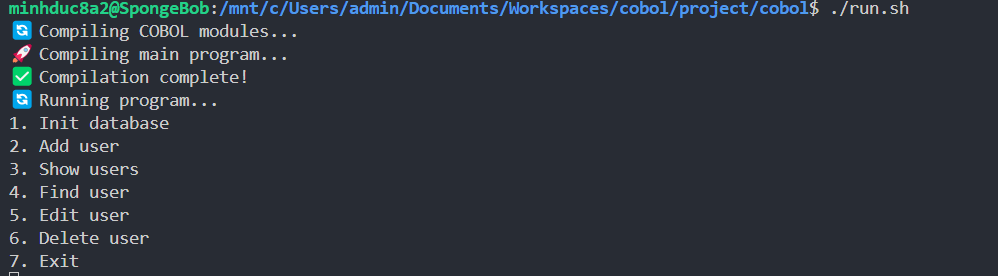

# Cobol
## Convert excel files to csv files
At folder "cobol/converter", open Command line
1. `.\setup_and_run.bat`
## Run Cobol program
At folder "cobol", open Ubuntu Terminal
1. `chmod +x run.sh`
2. `./run.sh`

>You need to initialize the database when running the program for the first time!
>You need to initialize the database when running the program for the first time!
>You need to initialize the database when running the program for the first time!
